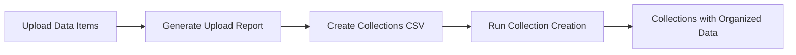

# Collection Endpoint Documentation

## 🎯 Overview

The **Collection endpoint** provides automated organization of uploaded datasets into logical collections using **folder pattern matching**. Unlike the Upload endpoint which creates individual datasets, the Collection endpoint creates **organizational containers** that group existing datasets based on configurable criteria.

## 🔄 Collection Workflow

### **Standard Process Flow**


### **Key Differences from Upload**
| Aspect | Upload Endpoint | Collection Endpoint |
|--------|----------------|-------------------|
| **Purpose** | Create datasets from files | Organize existing datasets |
| **Input** | Files + metadata | Folder patterns + metadata |
| **Output** | Individual datasets | Collections containing datasets |
| **Automation** | Manual file specification | Automatic pattern matching |
| **Metadata** | File-specific | Collection-level organization |

## 📁 Collection Modes

### **1. Folder Pattern Mode** (Recommended)
**Use case**: Automatic dataset organization based on folder structures

**How it works**:
1. Upload datasets create folder-based items (code/, data/, images/, etc.)
2. Collection CSV specifies folder patterns to match
3. System automatically includes matching datasets in collections
4. No manual dataset ID management required

**Example**:
```csv
title,description,data_items,status
"Research Code Collection","All programming files","files/code/",published
"Research Data Collection","All datasets","files/data/|files/results/",published
```

### **2. Explicit ID Mode** (Advanced)
**Use case**: Precise control over which datasets belong to collections

**How it works**:
1. Manually specify dataset IDs in collection configuration
2. Direct assignment without pattern matching
3. Requires knowledge of uploaded dataset IDs

## 🏗️ Collection Architecture

### **CSV Structure Overview**
```csv
title,status,description,keywords,language,creator,contributor,publisher,date,rights,coverage,relation,source,data_items
```

### **Core Transformation Pipeline**
```python
# Step 1: Parse Collection CSV Row
csv_row = {
    "title": "Research Collection",
    "description": "fr:Collection de recherche|en:Research Collection", 
    "data_items": "files/code/|files/data/",
    "status": "published"
}

# Step 2: Transform to Collection Metadata
metadata = prepare_collection_metadata(csv_row)
# Result: [{"propertyUri": "...", "value": "...", "lang": "fr"}, ...]

# Step 3: Resolve Data Items via Pattern Matching  
data_ids = match_folder_patterns(csv_row["data_items"], uploaded_datasets)
# Result: ["10.34847/nkl.abc12345", "10.34847/nkl.def67890"]

# Step 4: Create Collection
collection_payload = {
    "status": "published",
    "metas": metadata,
    "datas": data_ids
}
```

## 🎯 Quick Start Guide

### **Prerequisites**
1. **Completed Upload**: Datasets already uploaded to NAKALA
2. **Upload Report**: CSV output from upload process 
3. **API Access**: Valid NAKALA API key with collection creation rights

### **Basic Collection Creation**
```bash
# 1. Create collections from uploaded data
o-nakala-collection \
  --api-key "$NAKALA_API_KEY" \
  --from-folder-collections examples/collections.csv \
  --from-upload-output upload_report.csv

# 2. Dry run to preview (recommended)
o-nakala-collection \
  --api-key "$NAKALA_API_KEY" \
  --from-folder-collections examples/collections.csv \
  --from-upload-output upload_report.csv \
  --dry-run
```

### **Collection CSV Template**
```csv
title,description,data_items,status
"Code Repository","Programming files and scripts","files/code/",published
"Dataset Collection","Research data and results","files/data/|files/results/",published
"Documentation","Papers and documentation","files/documents/",pending
```

## 🔧 Processing Pipeline

### **1. Input Processing**
- **Collection CSV**: Metadata and folder patterns
- **Upload Report**: Previously uploaded dataset information
- **API Configuration**: Authentication and endpoint settings

### **2. Pattern Matching Logic**
```python
# Match folder patterns against uploaded dataset titles
def matches_folder_type(item_title, folder_patterns):
    for pattern in folder_patterns.split("|"):
        if pattern.strip() in item_title.lower():
            return True
    return False
```

### **3. Metadata Transformation**
- **Dublin Core Support**: Full Dublin Core metadata fields
- **Multilingual Processing**: Language-specific metadata entries
- **Property URI Mapping**: CSV fields → NAKALA property URIs

### **4. Collection Creation**
- **API Calls**: RESTful collection creation via NAKALA API
- **Error Handling**: Validation and retry logic
- **Report Generation**: Detailed success/failure reporting

## 🎓 Collection Metadata Fields

### **Required Fields**
- **`title`**: Collection name (supports multilingual)
- **`status`**: Collection visibility (`published`/`pending`/`private`)
- **`data_items`**: Folder patterns for dataset inclusion

### **Optional Dublin Core Fields**
- **`description`**: Collection description (supports multilingual)
- **`keywords`**: Subject keywords (semicolon-separated)
- **`creator`**: Collection creator(s)
- **`contributor`**: Additional contributors
- **`publisher`**: Publishing institution
- **`coverage`**: Temporal or spatial coverage
- **`relation`**: Related resources
- **`source`**: Source information
- **`language`**: Primary language
- **`date`**: Creation or coverage date
- **`rights`**: Access rights configuration

## 🌐 Multilingual Support

### **Format**: `"lang:text|lang:text"`
```csv
title,description
"fr:Collection française|en:French Collection","fr:Description en français|en:Description in English"
```

### **Supported Languages**
- **Language codes**: ISO 639-1/639-2 (fr, en, de, es, etc.)
- **Default language**: `und` (undefined) if no code specified
- **Multiple languages**: Pipe-separated entries

## 🎯 Folder Pattern Matching

### **Pattern Syntax**
```csv
# Single folder
data_items
"files/code/"

# Multiple folders  
data_items
"files/code/|files/scripts/|src/"

# Flexible patterns
data_items
"code|programming|scripts"
```

### **Matching Logic**
- **Case-insensitive**: Pattern matching ignores case
- **Substring matching**: Patterns match anywhere in dataset title
- **Multiple patterns**: OR logic (any pattern matches)
- **Folder mappings**: Uses predefined folder type mappings

## 📊 Expected Results

### **Successful Collection Creation**
- **Collections created**: One per CSV row
- **Persistent identifiers**: Assigned to each collection
- **Dataset inclusion**: Automatic based on patterns
- **Metadata structure**: Complete Dublin Core metadata
- **Access configuration**: Rights and visibility settings

### **Collection Report Output**
```csv
collection_title,collection_id,status,included_datasets,creation_date
"Research Code",10.34847/nkl.abc12345,published,3,2023-06-09T10:30:00Z
"Research Data",10.34847/nkl.def67890,published,5,2023-06-09T10:31:00Z
```

## 🔗 Related Documentation

- **[CSV Format Specification](./csv-format-specification.md)** - Complete CSV format rules
- **[Field Transformations](./field-transformations.md)** - Field-by-field transformation logic  
- **[Examples](../../../examples/sample_dataset/)** - Working collection CSV examples
- **[Validation](./validation/)** - Collection CSV validation tools

---

**API Endpoint**: `/collections` (POST)  
**Authentication**: API key required  
**Rate Limits**: Follow NAKALA API guidelines  
**Last Updated**: 2025-06-09