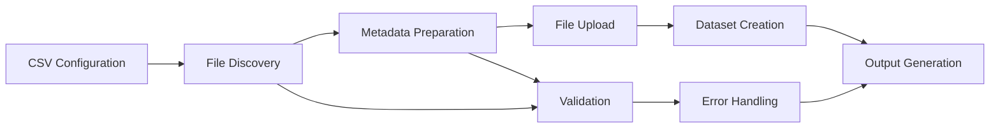

# Upload Endpoint Documentation

## 🎯 Overview

The Upload endpoint (`/datas` POST) is the **primary entry point** for ingesting research data into NAKALA. O-Nakala Core provides two modes for organizing and uploading data with metadata management.

## 📋 Quick Reference

| Mode | Use Case | CSV Structure | File Organization |
|------|----------|---------------|-------------------|
| **Folder Mode** | Research projects with organized file structure | One row per folder category | Files grouped by research type |
| **CSV Mode** | Individual datasets with explicit file lists | One row per dataset | Files specified explicitly |

## 🚀 Quick Start

### Basic Folder Upload
```bash
# Upload sample dataset using folder configuration
o-nakala-upload \
  --api-key "$NAKALA_API_KEY" \
  --dataset examples/sample_dataset/folder_data_items.csv \
  --mode folder \
  --output upload_results.csv
```

### Basic CSV Upload
```bash
# Upload individual files with metadata
o-nakala-upload \
  --api-key "$NAKALA_API_KEY" \
  --dataset my_datasets.csv \
  --mode csv \
  --output results.csv
```

## 🏗️ Upload Modes

### 1. Folder Mode (Recommended)
**Best for**: Research projects with organized file structures

**How it works**:
- Each CSV row maps a folder path to metadata
- All files in the folder become one dataset
- Automatic file discovery and organization
- Supports complex research data structures

**Example**: 14 files in 5 categories → 5 datasets

### 2. CSV Mode  
**Best for**: Explicit file control and individual datasets

**How it works**:
- Each CSV row specifies files and metadata explicitly
- Semicolon-separated file lists
- Direct control over file-to-dataset mapping
- Suitable for simple upload scenarios

## 📊 Processing Pipeline



## 🔧 Implementation Details

### Core Functions
- **`process_folder_structure()`** - Folder mode processing
- **`_process_csv_entry()`** - CSV mode processing  
- **`prepare_nakala_metadata()`** - Metadata transformation
- **`upload_file()`** - File upload to NAKALA
- **`create_dataset()`** - Dataset creation with metadata

### Error Handling
- **File validation** before upload
- **Metadata validation** with detailed error messages
- **API error parsing** with user-friendly explanations
- **Retry mechanisms** for network issues
- **Comprehensive logging** for debugging

### Performance Features
- **Parallel file uploads** for large datasets
- **Resume capability** for interrupted uploads
- **Memory-efficient processing** for large files
- **Progress tracking** and status reporting

## 📚 Documentation Structure

### Comprehensive Coverage
- **[CSV Format Specification](csv-format-specification.md)** - Complete format rules and examples
- **[Field Transformations](field-transformations.md)** - Field-by-field transformation logic
- **[Examples](../../../examples/sample_dataset/)** - Working examples for all scenarios
- **[Troubleshooting](troubleshooting.md)** - Common issues and solutions
- **[Validation](validation/)** - Format validation and testing tools

### Validation Status
- **Last validated**: 2025-06-08 ✅
- **API compatibility**: NAKALA Test API v2024 ✅  
- **Examples tested**: All examples validated with real API calls ✅
- **Transformation accuracy**: 100% verified against live API ✅

## 🎯 Expected Results

When properly configured, the Upload endpoint provides:

- **Reliable processing** for valid CSV formats
- **Automatic file organization** based on research structure  
- **Comprehensive metadata** with multilingual support
- **Persistent identifiers** (DOIs) for all datasets
- **Detailed upload reports** for tracking and validation

## 🔗 Next Steps

1. **[Start with CSV Format Specification](csv-format-specification.md)** - Learn the complete CSV format
2. **[Review Field Transformations](field-transformations.md)** - Understand metadata mapping
3. **[Try the Examples](../../../examples/sample_dataset/)** - Test with real configurations
4. **[Validate Your CSV](validation/)** - Check format before upload

---

**Ready to upload your research data with confidence!**